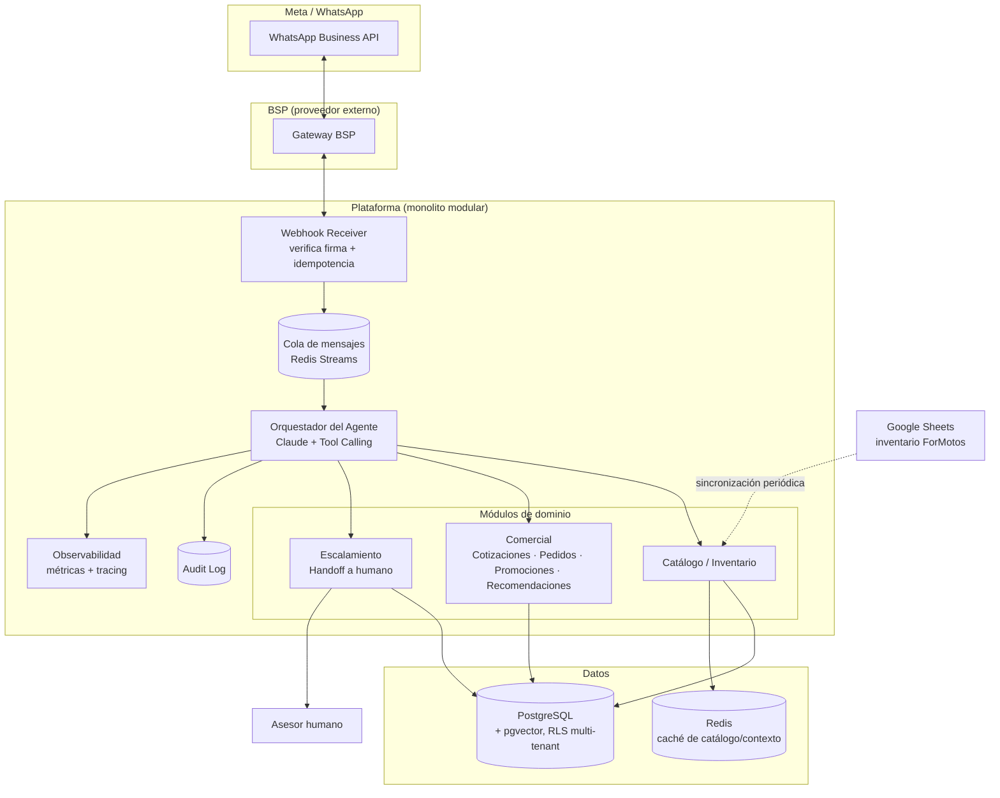
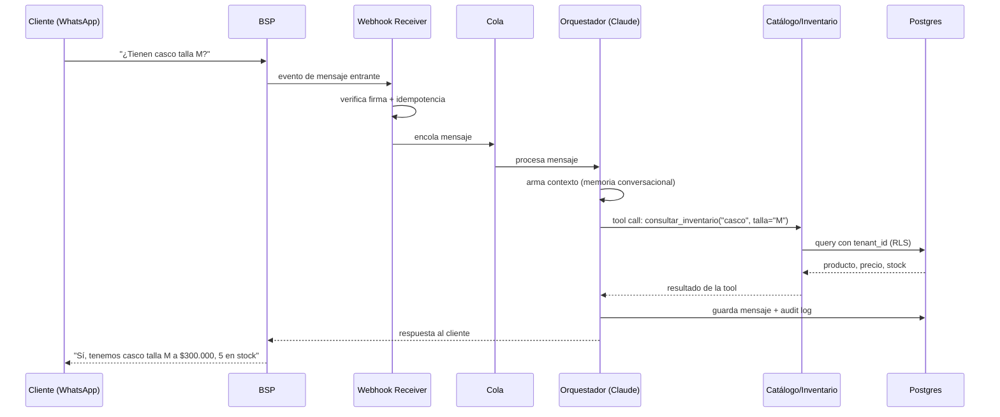

# Arquitectura Técnica

Basado en las decisiones registradas en [MASTER_PLAN.md](../../MASTER_PLAN.md) y validado contra el caso de uso de ForMotos ([Fase 0](../fase-0-descubrimiento.md)).

## Principio general

**Monolito modular** desplegado como un único servicio, organizado internamente por dominios claramente separados (no microservicios desde el día 1). Cada módulo puede extraerse a un servicio independiente en el futuro si un dominio específico lo exige por carga — pero no antes.

## Diagrama de contenedores

## Componentes

| Componente | Responsabilidad | Notas |
|---|---|---|
| **BSP (Business Solution Provider)** | Conexión oficial con la API de WhatsApp de Meta | No se construye — se integra un proveedor externo (ver [ADR-001](./adrs/ADR-001-bsp-whatsapp.md)) |
| **Webhook Receiver** | Recibe eventos del BSP, verifica firma (`X-Hub-Signature-256`), aplica idempotencia por `event_id` | Único punto de entrada de mensajes |
| **Cola de mensajes** | Desacopla la recepción de mensajes de su procesamiento, absorbe picos de tráfico | Redis Streams (ver [ADR-002](./adrs/ADR-002-broker-colas.md)) |
| **Orquestador del Agente** | Arma el contexto de cada turno, llama a Claude, ejecuta las tools que el modelo solicita, persiste el resultado | Ver [contratos-tools.md](./contratos-tools.md) |
| **Módulo Catálogo/Inventario** | Fuente de verdad de productos y stock, expuesta a través de la tool `consultar_inventario` | Sincroniza desde Google Sheets al inicio (ForMotos), diseñado para cambiar de fuente sin rediseño (ver [ADR-003](./adrs/ADR-003-estrategia-cache.md)) |
| **Módulo Comercial** | Cotizaciones, pedidos, promociones, recomendaciones | Cada acción es una tool con validación estricta contra Postgres — el LLM propone, la tool decide |
| **Módulo Escalamiento** | Máquina de estados con reglas explícitas que decide cuándo pasar la conversación a un asesor humano | No delega el criterio al LLM; el LLM es una señal más, no la autoridad |
| **Audit Log** | Registra cada decisión y tool call del agente | Requisito para depurar errores de venta y auditar el comportamiento del agente |
| **Observabilidad** | Métricas (latencia, tasa de escalamiento, costo por tenant) y tracing end-to-end | Ver Fase 8 del MASTER_PLAN |
| **PostgreSQL** | Persistencia de todo el sistema, con `pgvector` para embeddings de recomendación y Row Level Security para aislar tenants | Ver [modelo-datos.md](./modelo-datos.md) |
| **Redis** | Caché de catálogo (evita golpear Postgres en cada turno) y cola de mensajes | Invalidación por evento cuando cambia el inventario |

## Flujo de un mensaje (caso de uso: cliente pregunta por un producto)

## Multi-tenancy

Cada tabla relevante en Postgres incluye `tenant_id` y una política de Row Level Security que filtra por el tenant activo de la sesión (`current_setting('app.tenant_id')`). Esto se decide desde la primera tabla, no como capa añadida después (ver [ADR-004](./adrs/ADR-004-multi-tenancy-rls.md)).

## Qué queda fuera de esta fase

- Elección final de proveedor de nube / plataforma de despliegue (Fase 2).
- Detalle de CI/CD (Fase 2).
- Implementación de cualquier componente (ninguna fase de este plan incluye código).
