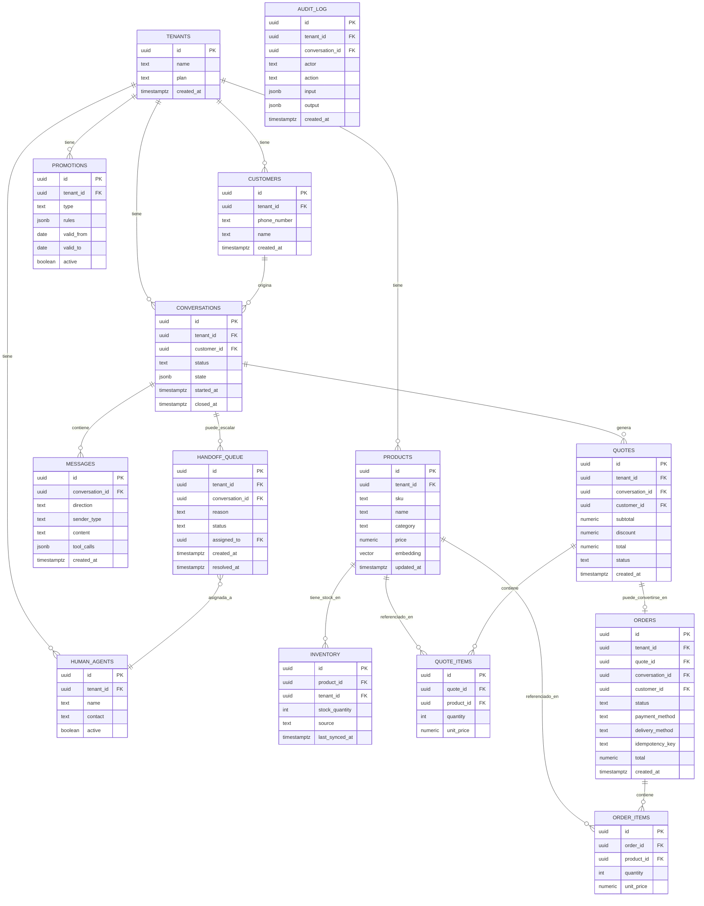

# Modelo de Datos (PostgreSQL)

Todas las tablas con datos de negocio incluyen `tenant_id` y quedan protegidas por Row Level Security (ver [ADR-004](./adrs/ADR-004-multi-tenancy-rls.md)). No se detalla DDL/SQL en esta fase — es diseño conceptual, la implementación llega en fases posteriores.

## Diagrama entidad-relación



## Notas de diseño por tabla

- **`tenants`** — una fila por PyME cliente (ej. ForMotos). Toda tabla de negocio cuelga de aquí vía `tenant_id`.
- **`conversations.state`** — memoria conversacional estructurada (no solo texto crudo): qué productos se mencionaron, en qué paso del flujo va el cliente, etc. Es lo que el orquestador lee para no "olvidar" contexto entre turnos.
- **`messages.tool_calls`** — guarda qué tool se invocó y con qué parámetros en ese turno, para trazabilidad fina a nivel de mensaje (complementa `audit_log`, que es la vista de auditoría a nivel de decisión de negocio).
- **`products.embedding`** — vector `pgvector` para similitud semántica, usado por la tool `recomendar_producto` sin necesidad de una vector DB separada.
- **`inventory.source` / `last_synced_at`** — necesario porque ForMotos hoy lleva el inventario en Google Sheets; el diseño permite que `source` cambie (Sheets, API de un ERP, CSV) sin tocar el resto del modelo.
- **`promotions.rules` (jsonb)** — modela tanto promociones por temporada (fechas de vigencia + % descuento) como por volumen (tramos de cantidad + beneficio), que es exactamente el caso de ForMotos. Estructura propuesta:
  ```json
  { "kind": "volumen", "tiers": [{"min": 10, "max": 20, "discount_pct": 5}, {"min": 20, "max": 40, "discount_pct": 10}] }
  { "kind": "temporada", "label": "fin_de_año", "discount_pct": 15 }
  ```
- **`orders.idempotency_key`** — obligatorio y único por tenant; evita pedidos duplicados si el webhook de WhatsApp reintenta la entrega de un mensaje.
- **`handoff_queue`** — cola explícita de conversaciones escaladas; separada de `conversations.status` para poder tener una bandeja de trabajo del asesor humano.
- **`audit_log`** — inmutable (solo insert), registra cada decisión del agente para depuración y confianza; es el requisito de observabilidad más básico del sistema.

## Row Level Security

Política estándar aplicada a toda tabla con `tenant_id`:

```sql
-- Ejemplo conceptual, no DDL final
CREATE POLICY tenant_isolation ON <tabla>
    USING (tenant_id = current_setting('app.tenant_id')::uuid);
```

La sesión de base de datos setea `app.tenant_id` al inicio de cada request/turno de conversación, según el tenant resuelto desde el número de WhatsApp entrante.
