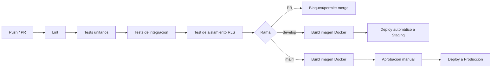

# Diseño del pipeline CI/CD

Documento de diseño — describe las etapas y decisiones; el YAML real de GitHub Actions se escribe al iniciar la implementación de código.

## Herramienta
**GitHub Actions**, por ser nativo del repositorio (ya en GitHub, con flujo Gitflow que requiere PRs revisados antes de mergear a `develop`/`main`) y sin costo adicional para un repositorio de este tamaño.

## Entornos

| Entorno | Rama que lo dispara | Propósito |
|---|---|---|
| **CI (validación)** | Cualquier PR hacia `develop` o `main` | Lint, tests, verificación de aislamiento RLS — bloquea el merge si falla |
| **Staging** | Push/merge a `develop` | Ambiente de prueba con datos de ForMotos de prueba, previo a producción |
| **Producción** | Push/merge a `main` (vía `release/*` o `hotfix/*`, según Gitflow) | Ambiente real, tráfico de ForMotos |

## Etapas del pipeline

1. **Lint** — estilo y errores estáticos básicos.
2. **Tests unitarios** — por dominio (`domains/catalog`, `domains/commerce`, `domains/escalation`).
3. **Tests de integración** — flujos completos simulados (mensaje entrante → tool call → respuesta), sin tocar WhatsApp real.
4. **Test de aislamiento RLS** — obligatorio y bloqueante: un tenant de prueba no debe poder leer datos de otro (ver [multi-tenant-rls.md](./multi-tenant-rls.md)). Este test se agrega desde el primer commit de infraestructura de base de datos, no después.
5. **Build de imagen Docker** — solo si los pasos anteriores pasan.
6. **Deploy a Staging** — automático en cada merge a `develop`, sin aprobación manual (entorno de bajo riesgo).
7. **Deploy a Producción** — requiere aprobación manual explícita (GitHub Environment protection rule), incluso si el build pasa. Coherente con Gitflow: producción solo se toca vía `release/*` o `hotfix/*`, nunca directo.

## Bases de datos efímeras para pruebas (pendiente de decidir en implementación)
Si el volumen de tests de integración/RLS lo justifica, evaluar usar el *branching* de Neon (ver [ADR-006](./adrs/ADR-006-postgres-gestionado.md)) para crear una base de datos aislada por Pull Request en vez de reutilizar una única base de staging para tests — reduce falsos positivos/negativos por estado compartido entre corridas de CI.

## Qué no incluye esta fase
- El YAML real de GitHub Actions (`.github/workflows/*.yml`) — implementación de código.
- Configuración de GitHub Environments y sus reglas de protección — se crea en GitHub al iniciar la implementación, no es un documento de arquitectura.
