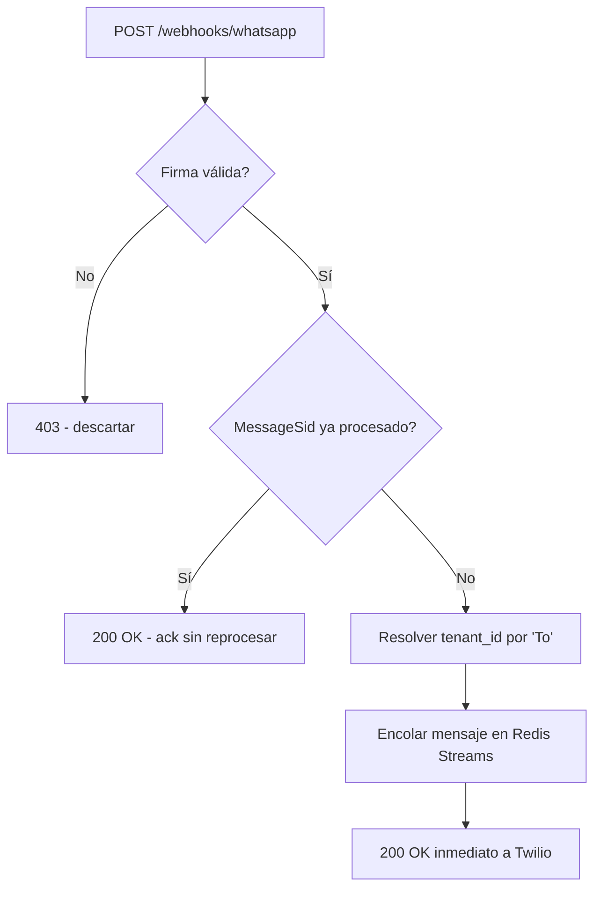

# Contrato del Webhook Receiver

## Corrección respecto al MASTER_PLAN

El `MASTER_PLAN.md` original describe la verificación de firma como `X-Hub-Signature-256`, que es el esquema **nativo de Meta** para webhooks directos. Como el [ADR-001](../fase-1-arquitectura/adrs/ADR-001-bsp-whatsapp.md) de la Fase 1 decidió operar a través de **Twilio** como BSP, los webhooks que recibe la plataforma vienen del servidor de Twilio, no directamente de Meta — y Twilio firma sus webhooks con un esquema propio: header **`X-Twilio-Signature`**, HMAC-SHA1 sobre la URL completa + parámetros del POST ordenados alfabéticamente, usando el Auth Token de la cuenta como clave. Este documento reemplaza esa referencia.

## Endpoint

```
POST /webhooks/whatsapp
```

Único punto de entrada de mensajes de WhatsApp hacia la plataforma. Vive en el módulo `gateway` (ver [estructura-repositorio.md](../fase-2-fundaciones/estructura-repositorio.md)).

## Verificación de firma (obligatoria, antes de cualquier otro procesamiento)

1. Leer el header `X-Twilio-Signature` de la request.
2. Reconstruir la cadena firmada: URL completa del webhook (tal como está configurada en la consola de Twilio) + parámetros del body, ordenados alfabéticamente por nombre de parámetro, concatenados como `clave+valor` sin separadores.
3. Calcular `HMAC-SHA1(cadena, auth_token)` y codificar en base64.
4. Comparar contra el valor del header con comparación de tiempo constante (evitar timing attacks).
5. Si no coincide → responder `403` inmediatamente, **no encolar el mensaje**.

> Recomendación de Twilio (y de este diseño): usar la librería oficial de validación del SDK de Twilio en vez de reimplementar el HMAC a mano, para evitar errores sutiles de encoding/orden de parámetros.

## Payload esperado (formato Twilio, no el nativo de Meta)

Twilio traduce el evento de WhatsApp a su propio formato de webhook de mensajería (`application/x-www-form-urlencoded`), con campos relevantes:

| Campo | Descripción |
|---|---|
| `MessageSid` | Identificador único del mensaje — clave de idempotencia (ver [idempotencia.md](./idempotencia.md)) |
| `From` | Número de WhatsApp del cliente (`whatsapp:+57...`) |
| `To` | Número de WhatsApp del negocio (usado para resolver `tenant_id`) |
| `Body` | Texto del mensaje |
| `NumMedia`, `MediaUrl0...` | Si el cliente envía imagen/audio (fuera de alcance del MVP textual, pero el contrato debe tolerarlo sin romper) |
| `ProfileName` | Nombre de perfil de WhatsApp del cliente |

## Flujo del receiver



El `200 OK` se responde apenas el mensaje queda encolado — el procesamiento real (llamada a Claude, tools, respuesta) ocurre de forma asíncrona vía el `orchestrator`, para no dejar a Twilio esperando una respuesta lenta del agente (ver [cola-mensajes.md](./cola-mensajes.md)).

## Qué no cubre este documento
- Implementación real del endpoint (código) — fuera del alcance de este plan de arquitectura.
- Envío de mensajes salientes (respuestas del agente) — es responsabilidad del `gateway` también, pero como cliente HTTP hacia la API de Twilio, no como webhook; se detalla al implementar, no requiere diseño de contrato adicional más allá de lo ya definido en los contratos de tools de la Fase 1.
