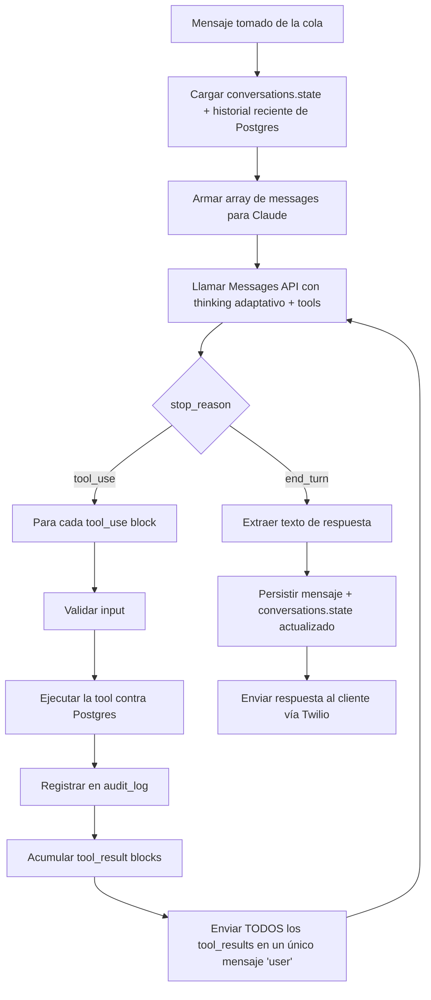

# Orquestador del Agente

## Decisión de diseño: loop manual, no tool runner automático

La API de Claude ofrece dos formas de manejar tool calling: un "tool runner" que ejecuta las tools automáticamente y hace el loop por ti, o un loop manual donde el código decide cuándo y cómo ejecutar cada tool. **Este proyecto usa el loop manual**, deliberadamente, por el principio ya establecido en la Fase 1: *"el LLM propone, la tool decide"*.

Con el tool runner automático, cualquier tool que Claude pida se ejecuta sin intervención — inaceptable para acciones de negocio como `crear_pedido`, donde el orquestador necesita: validar el input antes de ejecutar, registrar la decisión en `audit_log` (Fase 1), y en algunos casos aplicar reglas adicionales (ej. el `idempotency_key`) que no dependen del modelo. El loop manual da ese punto de control.

## Flujo por turno de conversación



Puntos de diseño explícitos:

- **Todos los `tool_result` de un mismo turno van en un único mensaje `user`.** Si Claude pide varias tools en paralelo (ej. consultar 3 productos a la vez), separar los resultados en mensajes distintos rompe el protocolo y además — según la documentación de la API — entrena al modelo a dejar de hacer llamadas paralelas.
- **`stop_reason: "pause_turn"`** (poco probable con las tools definidas en Fase 1, pero posible si se agregan tools server-side en el futuro) se maneja reenviando el mismo mensaje de usuario + la respuesta parcial del assistant, sin agregar un mensaje adicional de "continuar" — la API detecta el estado y retoma sola.
- **`stop_reason: "refusal"`** se trata como una señal de escalamiento: si Claude rehúsa responder, el orquestador no reintenta con el mismo prompt — dispara la tool `escalar_a_humano` con motivo `"queja"` o similar, y registra el `stop_details.category` en `audit_log` para revisión posterior.
- **Límite de iteraciones del loop** (ej. máximo 6 vueltas de tool_use antes de forzar una respuesta o escalar): evita que un error de razonamiento deje al agente llamando tools indefinidamente sin nunca responder al cliente.

## Configuración de la llamada a Claude

```json
{
  "model": "claude-sonnet-5",
  "max_tokens": 4096,
  "thinking": { "type": "adaptive" },
  "output_config": { "effort": "medium" },
  "system": [
    { "type": "text", "text": "<persona + reglas de negocio>", "cache_control": { "type": "ephemeral" } }
  ],
  "tools": ["<definidas en la Fase 1: consultar_inventario, generar_cotizacion, aplicar_promocion, crear_pedido, recomendar_producto, escalar_a_humano>"],
  "messages": ["<ver memoria-conversacional.md>"]
}
```

- `max_tokens: 4096` es suficiente para respuestas conversacionales — no se necesita streaming ni el límite de 128K para este caso de uso (evitar sobre-configurar).
- No se usa `tool_choice` forzado — se deja en `auto` (comportamiento por defecto), porque el agente debe decidir libremente si la pregunta del cliente requiere una tool o una respuesta directa.

## Qué NO cubre este documento
- Implementación real del loop (código) — fuera del alcance de este plan de arquitectura.
- Definición de las tools en sí — ya cubiertas en [contratos-tools.md](../fase-1-arquitectura/contratos-tools.md) (Fase 1).
