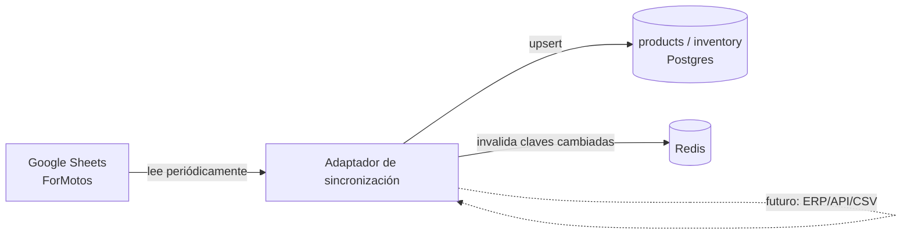

# Sincronización de Inventario

Extiende el diseño de `inventory.source` / `inventory.last_synced_at` ya definido en [modelo-datos.md](../fase-1-arquitectura/modelo-datos.md) (Fase 1) con el mecanismo concreto de sincronización para ForMotos.

## Fuente actual: Google Sheets

Según la [Fase 0](../fase-0-descubrimiento.md), ForMotos lleva hoy su inventario (300+ productos) en Google Sheets. La sincronización debe leer esa hoja periódicamente y reflejar los cambios en `products`/`inventory` (Postgres), sin acoplar el resto del sistema a que la fuente siempre sea Sheets.

## Principio de diseño: fuente intercambiable

Un componente `InventorySyncAdapter` (concepto, no interfaz de código) es responsable de traducir la fuente externa (hoy Sheets) al esquema interno de `products`/`inventory`. El resto del sistema — caché, tools, orquestador — nunca habla directamente con Google Sheets; solo lee de Postgres/Redis. Si ForMotos migra a un ERP o a un sistema de punto de venta en el futuro, se reemplaza el adaptador sin tocar ninguna otra capa.

## Frecuencia de sincronización

Se sincroniza por **polling periódico**, no en tiempo real — Google Sheets no tiene un mecanismo de webhook nativo confiable para notificar cambios de celda. Frecuencia propuesta: **cada 5 minutos**, alineada con el desfase máximo aceptado ya documentado en los criterios de éxito de la [Fase 0](../fase-0-descubrimiento.md#4-criterios-de-éxito-del-mvp).

## Qué se sincroniza

- **Alta/baja de productos** — filas nuevas o eliminadas en la hoja.
- **Cambios de precio** (`products.price`).
- **Cambios de stock** (`inventory.stock_quantity`).

No se sincronizan campos que no correspondan al modelo definido (ej. columnas de notas internas del negocio que no son relevantes para el agente).

## Manejo de errores de sincronización

- Si la sincronización falla (ej. la hoja no responde, un formato de celda inesperado), **no se borra el inventario existente** — se conserva el último estado válido conocido y se marca la falla en observabilidad (Fase 8), no en el flujo del agente. Un fallo de sincronización nunca debe traducirse en "no tenemos ningún producto" para el cliente.
- Cada corrida de sincronización registra en `inventory.last_synced_at` el momento del último éxito — permite detectar si la sincronización lleva más tiempo del esperado sin actualizar (alerta, ver Fase 8).
- Filas con datos inválidos (ej. precio no numérico) se omiten individualmente con un log de advertencia, sin abortar la sincronización completa del resto del catálogo.

## Qué no cubre este documento
- Credenciales/permisos de acceso a la hoja de Google Sheets — se resuelve como configuración/secreto (ver [ADR-007](../fase-2-fundaciones/adrs/ADR-007-gestion-secretos.md)) al implementar.
- Implementación real del adaptador (código) — fuera del alcance de este plan de arquitectura.
