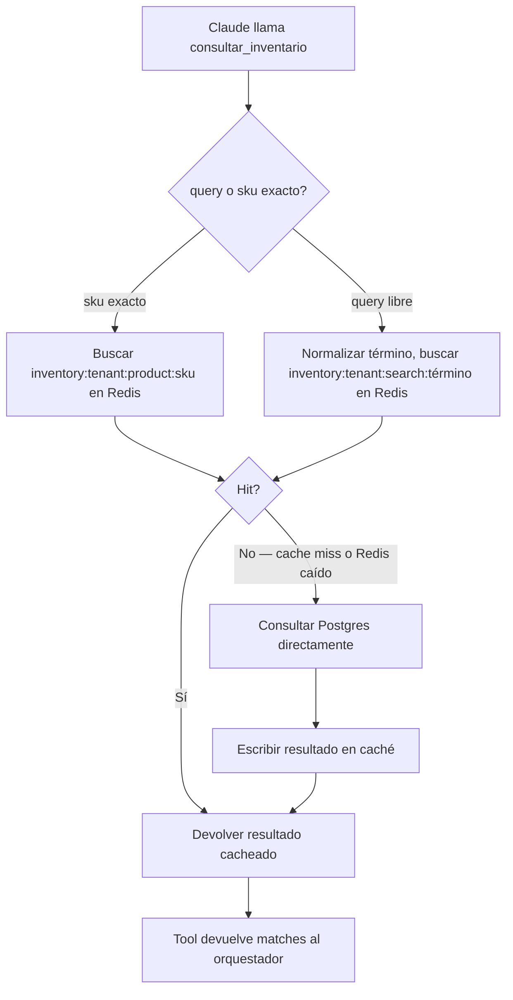

# Wiring de la tool `consultar_inventario`

Conecta el contrato ya definido en [contratos-tools.md](../fase-1-arquitectura/contratos-tools.md) (Fase 1) con la capa de caché/sincronización de esta fase.

## Flujo de ejecución

## Búsqueda por término libre

Cuando el cliente pregunta con lenguaje natural ("¿tienen algo para lluvia?", "casco integral"), la tool no puede depender de un match exacto de texto contra `products.name`. Se resuelve con dos niveles:
1. **Búsqueda por texto** (`ILIKE` / full-text search de Postgres) contra `name`, `sku`, `category` — cubre la mayoría de casos de un catálogo de 300+ productos con nombres razonablemente descriptivos.
2. **Fallback semántico** vía el embedding ya definido en `products.embedding` (Fase 1, pensado originalmente para `recomendar_producto`) — se reutiliza aquí si la búsqueda por texto no encuentra nada, para cubrir términos que el cliente usa pero no coinciden literalmente con el catálogo (ej. "casco para la lluvia" cuando el producto se llama "Casco Integral Impermeable X200").

## Coincidencias ambiguas

Si la búsqueda devuelve más de un producto razonablemente relevante (ej. el cliente pide "guantes" y hay 5 modelos), la tool devuelve **todos los matches relevantes** (hasta un límite razonable, ej. 5) en vez de adivinar uno solo — es responsabilidad del agente, no de la tool, decidir si debe preguntar al cliente cuál prefiere o mostrar las opciones. Esto es consistente con "la tool decide sobre los datos, el LLM decide la conversación".

## Variantes (talla, color)

El campo `variants` en el contrato de la tool (Fase 1) se resuelve a partir de productos relacionados por el mismo `sku` base o `category` + atributo — el modelo de datos exacto de variantes (¿son filas separadas en `products`, o un campo `variants` dentro de un producto?) queda como decisión a tomar con datos reales del catálogo de ForMotos al iniciar la implementación, ya que la Fase 0 no levantó el detalle de si el catálogo maneja variantes como productos separados o como atributos de un mismo producto.

## Qué no cubre este documento
- Implementación real de la búsqueda (código, consultas SQL exactas) — fuera del alcance de este plan de arquitectura.
- Decisión final del modelo de variantes — pendiente de datos reales del catálogo, marcado arriba.
