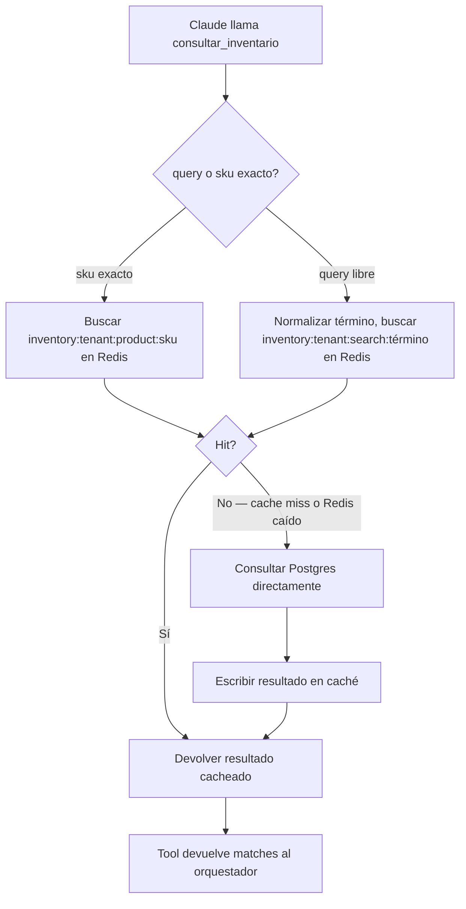

# Wiring de la tool `consultar_inventario`

Conecta el contrato ya definido en [contratos-tools.md](../fase-1-arquitectura/contratos-tools.md) (Fase 1) con la capa de caché/sincronización de esta fase.

## Flujo de ejecución

## Búsqueda por término libre

Cuando el cliente pregunta con lenguaje natural ("¿tienen algo para lluvia?", "casco integral"), la tool no puede depender de un match exacto de texto contra `products.name`. Se resuelve con dos niveles:
1. **Búsqueda por texto** (`ILIKE` / full-text search de Postgres) contra `name`, `sku`, `category` — cubre la mayoría de casos de un catálogo de 300+ productos con nombres razonablemente descriptivos.
2. **Fallback semántico** vía el embedding ya definido en `products.embedding` (Fase 1, pensado originalmente para `recomendar_producto`) — se reutiliza aquí si la búsqueda por texto no encuentra nada, para cubrir términos que el cliente usa pero no coinciden literalmente con el catálogo (ej. "casco para la lluvia" cuando el producto se llama "Casco Integral Impermeable X200").

## Coincidencias ambiguas

Si la búsqueda devuelve más de un producto razonablemente relevante (ej. el cliente pide "guantes" y hay 5 modelos), la tool devuelve **todos los matches relevantes** (hasta un límite razonable, ej. 5) en vez de adivinar uno solo — es responsabilidad del agente, no de la tool, decidir si debe preguntar al cliente cuál prefiere o mostrar las opciones. Esto es consistente con "la tool decide sobre los datos, el LLM decide la conversación".

## Variantes (talla, color) — resuelto

**Decisión: cada variante es una fila separada en `products`**, con su propio `product_id` y `sku` (ej. `CASCO-X200-M`, `CASCO-X200-L`), no un atributo dentro de un único producto "padre". Las variantes se agrupan por un campo compartido (`base_sku` o `category` + nombre base) solo para efectos de presentación — cuando la tool encuentra varias filas que comparten ese agrupador, las devuelve juntas en el arreglo `variants` del contrato de la Fase 1, cada una con su propio `product_id`, precio y stock independientes (dos tallas del mismo casco pueden tener stock distinto).

Esto es consistente con cómo ya se diseñó el resto del sistema: `inventory.stock_quantity` es por `product_id`, así que cada variante necesita su propia fila para que el stock se controle de forma independiente — una talla agotada no debe bloquear la venta de otra talla del mismo modelo.

## Qué no cubre este documento
- Implementación real de la búsqueda (código, consultas SQL exactas) — fuera del alcance de este plan de arquitectura.
- El campo exacto usado para agrupar variantes (`base_sku` vs. parsing de `name`) — detalle de implementación, no de arquitectura.
