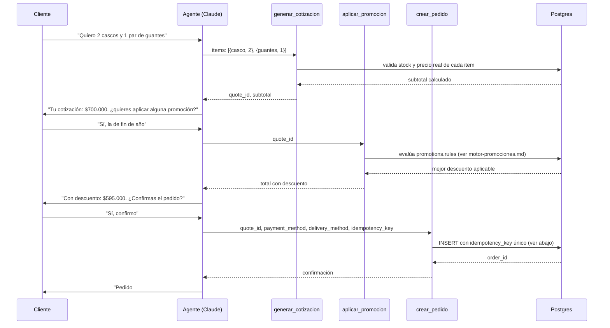

# Flujo Cotización → Promoción → Pedido

Encadena las tres tools comerciales ya definidas en la Fase 1 (`generar_cotizacion`, `aplicar_promocion`, `crear_pedido`) en el flujo real de una venta de ForMotos, con foco en cómo se evita duplicar pedidos.

## Flujo completo

## Cómo se evita duplicar el pedido

Dos capas de protección, ya anticipadas en fases anteriores pero que aquí se conectan:

1. **Idempotencia de transporte** ([idempotencia.md](../fase-3-whatsapp-gateway/idempotencia.md), Fase 3) — si Twilio reintenta la entrega del mensaje "Sí, confirmo" porque no recibió el ACK a tiempo, el `gateway` ya filtra el mensaje duplicado por `MessageSid` **antes** de que llegue al orquestador. En el caso normal, esto solo evita que el mensaje se vuelva a *procesar*.
2. **Idempotencia de negocio** (contrato de `crear_pedido`, Fase 1) — el `idempotency_key` que exige la tool es independiente del transporte: se genera a partir de `quote_id` + un identificador estable del intento (ej. hash de `quote_id` + el `MessageSid` que disparó la confirmación). Si por cualquier motivo el orquestador llega a invocar `crear_pedido` dos veces para la misma cotización confirmada (ej. un reintento a nivel de aplicación, no solo de transporte), la restricción `UNIQUE` sobre `orders.idempotency_key` en Postgres rechaza el segundo insert, y la tool devuelve `status: "duplicate"` con el `order_id` ya existente en vez de crear uno nuevo.

Esta segunda capa es la que realmente protege el negocio — cubre no solo reintentos del webhook, sino también errores de razonamiento del propio agente (ej. si Claude, por confusión, llama `crear_pedido` dos veces en la misma respuesta).

## Qué pasa si el cliente cambia de opinión a mitad del flujo

Si el cliente pide modificar la cotización después de generarla pero antes de confirmar el pedido (ej. "mejor solo 1 casco"), el agente vuelve a llamar `generar_cotizacion` con los items actualizados — esto crea un `quote_id` nuevo, no edita el anterior. Las cotizaciones son inmutables una vez generadas (consistente con que `quote_items` no tiene una operación de "editar" en el contrato de la Fase 1); la cotización vieja simplemente queda con `status: "draft"` sin convertirse nunca en pedido. Esto simplifica la auditoría: cada `quote_id` representa una propuesta de precio en un momento dado, no un documento mutable.

## Qué no cubre este documento
- Implementación real del flujo (código) — fuera del alcance de este plan de arquitectura.
- El mecanismo exacto de generación del `idempotency_key` (qué hash, qué inputs exactos) — detalle de implementación.
