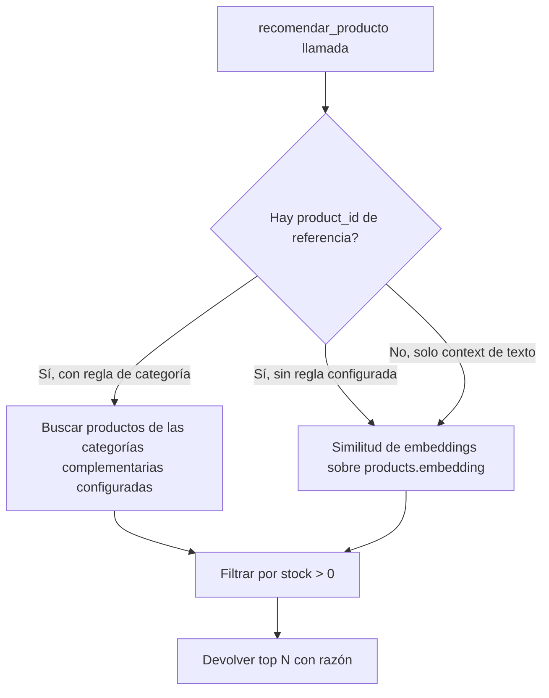

# Wiring de la tool `recomendar_producto`

Conecta el contrato ya definido en [contratos-tools.md](../fase-1-arquitectura/contratos-tools.md) (Fase 1) con `pgvector` (ya presente en el modelo de datos vía `products.embedding`) y reglas simples — sin modelo de ML propio, según la decisión ya tomada en la arquitectura general.

## Dos fuentes de recomendación, combinadas

1. **Similitud semántica (pgvector)** — dado un `product_id` de referencia o el texto de la conversación reciente, se calcula la distancia de embeddings contra el resto del catálogo activo del tenant, y se toman los N más cercanos (ej. top 5).
2. **Reglas simples de complementariedad** — para un negocio de accesorios de moto, la similitud semántica sola no captura bien las recomendaciones más naturales (ej. quien compra un casco probablemente necesita guantes, no otro casco). Se define una tabla de complementariedad simple por `category`:

   ```json
   { "casco": ["guantes", "chaqueta"], "llanta": ["camara", "valvula"], "guantes": ["casco"] }
   ```

   Esta tabla vive como configuración (no como código embebido), para que se pueda ajustar por tenant sin redeploy.

## Cómo se combinan

La tool prioriza las reglas de complementariedad cuando el `product_id` de referencia tiene una entrada configurada (recomendaciones más relevantes para venta cruzada real), y usa similitud pura por embeddings como fallback cuando no hay regla definida para esa categoría, o cuando la recomendación parte solo de `context` (texto de la conversación) sin un producto de referencia claro.



## El campo `reason`

El contrato de la Fase 1 exige un campo `reason` por recomendación — se completa de forma simple y determinística según la fuente: `"Frecuentemente comprado junto con {producto de referencia}"` para las basadas en reglas de complementariedad, `"Similar a lo que estás viendo"` para las basadas en embeddings. No se le pide a Claude que redacte esta razón — es un texto generado por la tool, consistente con el principio de que las tools devuelven datos confiables, no texto libre del modelo.

## Filtro de stock

Nunca se recomienda un producto sin stock disponible — sería contraproducente para la conversión de venta. El filtro `stock > 0` es obligatorio en ambas rutas (reglas y embeddings), no opcional.

## Qué no cubre este documento
- Implementación real de la consulta pgvector (código, índices) — fuera del alcance de este plan de arquitectura.
- La tabla de complementariedad completa para todo el catálogo de ForMotos — se construye con el catálogo real al implementar, este documento solo fija el mecanismo.
